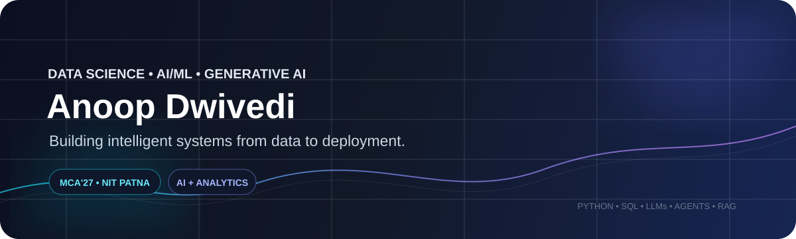
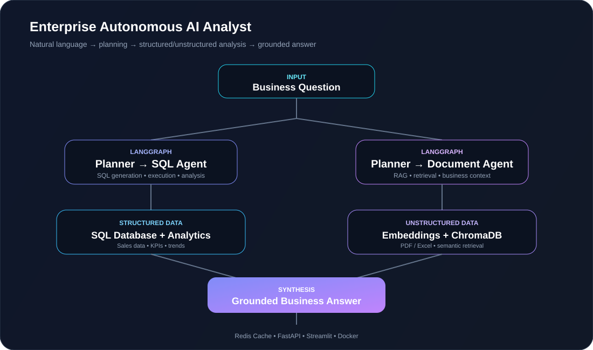

<div align="center">



<br/>

<a href="https://www.linkedin.com/in/anoop-dwivedi/">

</a>
<a href="mailto:anoopdwivedi816@gmail.com">

</a>
<a href="https://github.com/anoopkd7460">

</a>

<br/><br/>

**Data Science** · **Machine Learning** · **Generative AI** · **Agentic AI** · **Business Analytics**

</div>

---

## 🧠 Who I Am

I'm **Anoop Dwivedi**, an **MCA'27 student specializing in Data Science & Informatics at NIT Patna**.

I build practical systems at the intersection of **data, machine learning and modern AI** — from analytics dashboards and ML models to LLM-powered applications and autonomous AI workflows.

> **My goal:** turn messy data and complex problems into reliable, useful and deployable solutions.

### ⚡ My Build Loop

```text
Problem
   ↓
Data
   ↓
Reasoning / Modeling
   ↓
Evaluation
   ↓
Deployment
   ↓
Impact
```

---

# 🛠️ Tech Stack

### Languages


### Data Science & Analytics


### Machine Learning & Deep Learning


### Generative AI & Agentic AI


### Backend & Deployment


### Databases


---

# 🚀 Featured Projects

<table>
<tr>
<td width="50%" valign="top">

## 🤖 Enterprise Autonomous AI Analyst

**LLMs · LangGraph · SQL · RAG · ChromaDB · Redis**

An autonomous AI analytics platform that lets business users ask questions in natural language and receive insights from **structured SQL data and unstructured PDF/Excel reports**.

### What makes it interesting

- 🧩 Planner-based agent orchestration
- 🗄️ Natural-language SQL analytics
- 🔎 RAG + semantic retrieval
- 🧠 Cross-source answer synthesis
- ⚡ Redis response caching
- 🚀 FastAPI + Streamlit
- 🐳 Dockerized architecture

</td>
<td width="50%" valign="top">

## 📊 Enterprise Inventory Analytics

**SQL Server · Power BI · DAX · Power Query**

Enterprise-style dashboard for monitoring inventory health, demand, availability and supply shortages.

### Highlights

- 📦 **124K+** units of demand analyzed
- 📦 **63K+** units of availability
- 📈 Interactive Power BI dashboard
- 🧮 DAX KPI measures
- 🔄 Power Query transformations
- 🔎 SQL-based business analysis
- 📋 Business requirements & KPI documentation

</td>
</tr>
<tr>
<td width="50%" valign="top">

## 🩺 Vision Transformer for Biomedical Images

**PyTorch · Hugging Face · ViT · MedMNIST**

Research reproduction and optimization of Vision Transformer-based biomedical image classification.

**Datasets:** BreastMNIST · BloodMNIST · PathMNIST · RetinaMNIST

**Focus:** model implementation, library compatibility, training optimization and evaluation.

</td>
<td width="50%" valign="top">

## 🔬 What I Like Building

```text
Data
 ↓
Intelligence
 ↓
Automation
 ↓
Product
```

I’m especially interested in systems that combine:

**LLMs + Data + Tools + Retrieval + Agents + APIs**

to solve real business and technology problems.

</td>
</tr>
</table>

---

# 🤖 Deep Dive — Enterprise Autonomous AI Analyst



### 🔄 Core Flow

```text
User Question
      ↓
LangGraph Planner
      ↓
 ┌───────────────┬────────────────┐
 ↓               ↓
SQL Agent     Document Agent
 ↓               ↓
SQL Analysis   RAG Retrieval
 ↓               ↓
 └─────── Answer Synthesis ───────┘
                  ↓
             Redis Cache
                  ↓
         FastAPI / Streamlit
                  ↓
                Docker
```

### 🎯 Example Business Questions

```text
"What caused the decline in regional sales?"

"Which products have the largest inventory gap?"

"What does the business report say about the supply shortage?"

"Compare sales performance across regions."

"Find the root cause mentioned in the uploaded report."
```

---

# 📚 Current Learning Path

```text
Data Analytics
      ↓
Data Science
      ↓
Machine Learning
      ↓
Deep Learning
      ↓
Generative AI
      ↓
LLM Applications
      ↓
RAG & Vector Search
      ↓
Agentic AI
      ↓
Production AI Systems
```

I'm currently focusing on building a stronger understanding of **LLM application architecture, agent orchestration, retrieval systems, AI-powered analytics and production deployment**.

---

# 🏆 Achievements

- 🥇 **NIMCET 2024 — All India Rank 544**
- 👨‍💻 **Web & Coding Team Member — NIT Patna (2024–25)**

---

# 📜 Certifications

- 🎓 [**Generative AI, LLM & RAG**](https://www.geeksforgeeks.org/certificate/e48a006808e5ab524eb9aa55a1095a76) — GeeksforGeeks
- 📊 [**Data Analyst Bootcamp: Basic to Advanced**](https://www.udemy.com/certificate/UC-9aaaf16a-accd-4f59-adaf-6d84df1674fb/) — Udemy
- 🗄️ [**SQL Basic**](https://www.hackerrank.com/certificates/iframe/9e1e0b25d823) · [**SQL Intermediate**](https://www.hackerrank.com/certificates/7a7b912787f5) — HackerRank
- 🐍 [**Python Basic**](https://www.hackerrank.com/certificates/iframe/a8b7ca56f4d5) — HackerRank

---

## 📈 GitHub Activity

<p align="center">
  
</p>

<p align="center">
  <a href="https://github.com/anoopkd7460">
    
  </a>
  <a href="https://github.com/anoopkd7460?tab=repositories">
    
  </a>
</p>

> 🚀 Building and shipping projects across **Generative AI, Agentic AI, Data Science, Machine Learning, and Software Engineering**.
---

# 🤝 Let's Connect

<div align="center">

### Open to internships, entry-level and full-time opportunities

**Data Science · AI/ML · Generative AI · Agentic AI · Data Analytics**

<br/>

<a href="https://www.linkedin.com/in/anoop-dwivedi/">

</a>
&nbsp;
<a href="mailto:anoopdwivedi816@gmail.com">

</a>

<br/><br/>

**🚀 Build. Learn. Solve. Repeat.**

</div>
